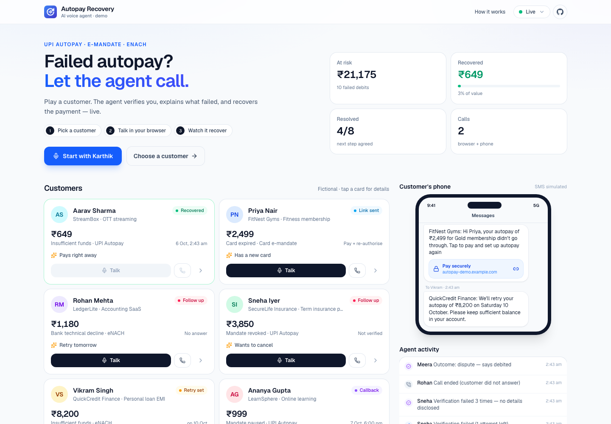
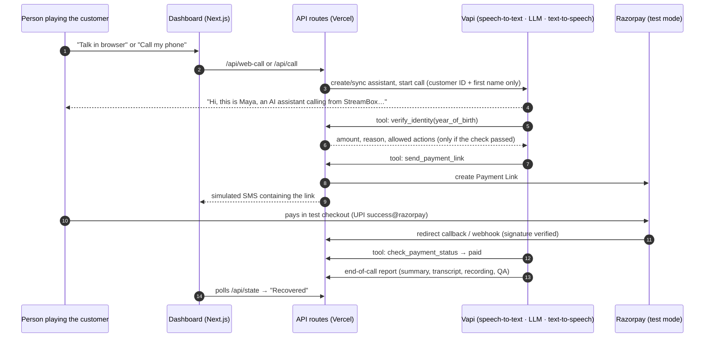

# Autopay Recovery Agent

An AI voice agent that calls customers whose **UPI Autopay / card e-mandate / eNACH** debit failed and gets them back on track. It confirms who it's talking to, explains *why* the debit failed in plain language, and picks the fix that matches the failure:

| Failure | What the agent does |
|---|---|
| Insufficient funds | Pay-now link **or** schedule a retry on a date the customer chooses (within the grace window) |
| Card expired · bank account closed · mandate revoked · amount above mandate limit | Link to pay **and** re-authorise autopay (a plain retry would fail again, so the API refuses one) |
| Bank technical decline | Reassure the customer, then schedule a retry or send a pay-now link |
| Mandate paused | Ask them to resume it in their UPI app, then retry, or send a pay-now link |
| "I already paid" · wants to cancel · hardship · wants a human | Hand off to a human team. It never pushes for payment. |
| "Stop calling me" · wrong person | Records do-not-call and blocks future calls · reveals nothing to a third party |

The demo has a live dashboard with 10 **fictional** customers, browser and real phone calls, **Razorpay Test Mode payment links**, a simulated SMS inbox, call transcripts and recordings, and an AI post-call summary with a compliance check.

> **Live demo:** `https://<your-deployment>.vercel.app` · **Demo video:** `<link>`



---

## How a call works



**Agent tools**, each enforced on the server ([src/lib/tools.ts](src/lib/tools.ts)):

- `verify_identity`
- `send_payment_link` (`pay_now` | `update_mandate`)
- `schedule_payment_retry`
- `schedule_callback`
- `check_payment_status`
- `record_outcome` (`dispute`, `cancellation_request`, `hardship`, `escalate_to_human`, `do_not_call`, `wrong_person`, `refused`)
- `endCall`

## Guardrails

- **Only calls a number I control.** Every outbound call dials `DEMO_DESTINATION_NUMBER`, a single number the operator owns. The fictional records use `+91 00000…` numbers. Indian mobile numbers must start with 6–9, so these can never be dialled.
- **Verifies before disclosing.** The prompt contains no account data. The amount and failure reason come back only from `verify_identity`, after the server checks the year of birth. The model never sees the answer. Verification locks after 3 failed attempts.
- **Business rules live in code, not the prompt.** The API validates:
  - retry dates (tomorrow up to the end of the grace window)
  - that the failure is retryable at all
  - callback slots (8 AM–7 PM IST, within 7 days)

  If the model tries something invalid, it gets back an `instruction` explaining why and what to offer instead.
- **Fair-collection conduct** (in the spirit of RBI's recovery-agent guidance):
  - discloses it's an AI and that the call may be recorded
  - no threats, shaming, or talk of credit scores or legal action
  - never asks for OTP, PIN or CVV
  - outbound calls only between 8 AM and 7 PM IST
  - do-not-call takes effect immediately and blocks future calls
- **Automated compliance check.** After each call, Vapi's analysis flags anything the agent said that breaches these rules. Flags appear in the activity feed and on the customer's detail panel.
- **Each call is tied to one customer.** Tools act on the customer the server bound to the call, not on whatever ID the model passes, so a confused or manipulated model can't touch another account.
- **Safe to retry.** Tool calls are de-duplicated by ID, so a webhook retry never acts twice. An open payment link is re-sent rather than duplicated. Razorpay callbacks and webhooks are HMAC-verified, and webhook events are de-duplicated.
- **Secrets stay on the server.** The assistant is stored in Vapi (synced automatically from code), so the webhook secret never reaches the browser. Browser calls are capped per day so a public link can't drain credits. "Call my phone" and "Reset" require `ADMIN_PASSCODE`.

## Stack (all free tiers)

| Piece | Choice | Why |
|---|---|---|
| Voice | [Vapi](https://vapi.ai) (Deepgram nova-3 speech-to-text, GPT-4.1, Vapi voice) | Free credits, browser and phone calls, tool calling, recordings, post-call analysis |
| App + API | Next.js 16 on Vercel Hobby | One repo for the UI and webhooks; free HTTPS URL |
| Payments | Razorpay Payment Links, **Test Mode** | No KYC needed for test mode. Falls back to a built-in mock checkout without keys. |
| State | Upstash Redis (Vercel Marketplace, free) | Shared state across serverless instances. Uses memory when running locally. |

---

## Run it locally (about 10 minutes)

**Prerequisites:** Node 20+ and a free [Vapi account](https://dashboard.vapi.ai). Razorpay is optional.

```bash
git clone https://github.com/jayasinghthakur/autopay-recovery-agent.git && cd autopay-recovery-agent
npm install
cp .env.example .env.local      # then fill in VAPI_PRIVATE_KEY and VAPI_PUBLIC_KEY
```

Vapi has to reach your webhooks, so expose localhost through a tunnel:

```bash
npm run dev                                            # http://localhost:3000
npx cloudflared tunnel --url http://localhost:3000     # in a second terminal (or: ngrok http 3000)
```

Then:

1. Put the `https://….trycloudflare.com` URL in `.env.local` as `PUBLIC_BASE_URL`.
2. Restart `npm run dev`.
3. Open the dashboard and click **Talk in browser** on any customer. Allow microphone access.
4. Open the customer's detail panel to see the **verification answer** (year of birth) and a suggested role-play.

The first call creates the Vapi assistant automatically; there's nothing to set up in the Vapi dashboard.

## Deploy for free (Vercel)

1. Push this repo to GitHub, then go to [vercel.com/new](https://vercel.com/new) and import it.
2. Under **Environment Variables**, add `VAPI_PRIVATE_KEY`, `VAPI_PUBLIC_KEY` and `ADMIN_PASSCODE`. Add the optional variables below if you want them.
3. Deploy. Then go to **Storage → Create → Upstash (Redis) → Connect to project**. This injects `KV_REST_API_URL` and `KV_REST_API_TOKEN`.
4. Redeploy.

You don't need `PUBLIC_BASE_URL` on Vercel: the app uses the production URL for webhooks.

### Optional: real phone calls (to your own phone only)

Vapi's free numbers are inbound-only, so outbound calls need an imported number:

1. **Twilio trial** (free credit): get a trial number and add your own mobile under *Verified Caller IDs*. Trial accounts can only call verified numbers. If you're calling an Indian number from a non-Indian Twilio number, enable India under *Voice → Geo permissions*. A trial account may play a short notice before connecting.
2. In the **Vapi dashboard**, go to Phone Numbers → Import → Twilio and enter your SID, auth token and number. Copy the **Phone Number ID**.
3. Set `VAPI_PHONE_NUMBER_ID`, and set `DEMO_DESTINATION_NUMBER` to your own number (E.164, e.g. `+9198XXXXXXXX`).
4. Click **Call my phone**. Your phone rings, and you play the customer.

Calls are blocked outside 8 AM–7 PM IST. Set `IGNORE_CALLING_HOURS=true` to record a demo at another time.

Vonage, Telnyx or a SIP trunk (e.g. Plivo or Exotel for Indian numbers) work the same way through Vapi's import.

For **Telnyx**:

- You don't need to create a Voice API application. Create an API v2 key in Telnyx and choose **Vapi → Phone Numbers → Import Telnyx**.
- Then, in Telnyx, go to **Voice → Outbound Voice Profiles**. Enable the destination country and add the connection Vapi uses.
- Calling India may require Telnyx Level 2 verification.
- Vapi documents a codec mismatch (A-law vs µ-law) on calls outside North America that can garble audio. A US Telnyx number or Twilio avoids it.

### Optional: Razorpay Test Mode

1. Sign up at [dashboard.razorpay.com](https://dashboard.razorpay.com). Test mode works without KYC.
2. Go to Settings → API Keys → Generate **test** key, and set `RAZORPAY_KEY_ID` and `RAZORPAY_KEY_SECRET`.
3. When paying on the test checkout, use UPI ID **`success@razorpay`** or card `4100 2800 0000 1007` (any future expiry, any CVV).
4. Optional webhook: go to Settings → Webhooks and add `https://<app>/api/razorpay/webhook` with the event `payment_link.paid`. Set the secret as `RAZORPAY_WEBHOOK_SECRET`. This catches payments where the customer closes the tab before being redirected back.

## Environment variables

| Variable | Required | Purpose |
|---|---|---|
| `VAPI_PRIVATE_KEY`, `VAPI_PUBLIC_KEY` | yes | Vapi API (server) and Web SDK (browser calls) |
| `ADMIN_PASSCODE` | on a public deploy | Guards "Call my phone" and "Reset demo" |
| `VAPI_PHONE_NUMBER_ID`, `DEMO_DESTINATION_NUMBER` | for phone calls | Imported caller ID · **your own** number |
| `RAZORPAY_KEY_ID`, `RAZORPAY_KEY_SECRET` | optional | Real test-mode payment links (otherwise mock) |
| `RAZORPAY_WEBHOOK_SECRET` | optional | Verifies `payment_link.paid` webhooks |
| `KV_REST_API_URL`, `KV_REST_API_TOKEN` | on Vercel | Upstash Redis (`UPSTASH_REDIS_REST_*` also accepted) |
| `PUBLIC_BASE_URL` | local dev | Tunnel URL Vapi and Razorpay call back to |
| `VAPI_MODEL_PROVIDER` / `VAPI_MODEL` / `VAPI_VOICE_*` | optional | Swap the LLM (e.g. `anthropic` / `claude-haiku-4-5-20251001`) or the voice |
| `IGNORE_CALLING_HOURS`, `WEB_CALL_DAILY_LIMIT` | optional | Demo overrides |

## Automated checks

`scripts/e2e.mjs` plays Vapi's role. It sends the same webhook payloads Vapi would and checks the whole flow without a phone or any credits, across 34 checks:

- verification, including no detail leakage and the lockout
- link creation and reuse
- paying during the call
- retry-window and non-retryable rules
- callback hours
- do-not-call blocking future calls
- cross-customer protection
- duplicate tool calls
- no-answer handling
- Razorpay signature rejection
- reset

```bash
npm run build
VAPI_WEBHOOK_SECRET=testsecret ADMIN_PASSCODE=demo VAPI_PRIVATE_KEY=x VAPI_PUBLIC_KEY=x \
VAPI_PHONE_NUMBER_ID=x DEMO_DESTINATION_NUMBER=+10000000000 IGNORE_CALLING_HOURS=true npx next start -p 3100
npm run test:e2e            # in another terminal → 34/34 passed
```

## Project layout

```
src/data/customers.ts        10 fictional records + failure-reason playbook
src/lib/agent.ts             system prompt, tool schemas, post-call analysis schema
src/lib/tools.ts             server-side logic behind every tool (the business rules)
src/lib/vapi.ts              assistant auto-sync + outbound call API
src/lib/razorpay.ts          payment links, callback + webhook signature checks
src/lib/guards.ts            calling hours, do-not-call, no double-dialling
src/lib/store.ts, kv.ts      state on Redis / in-memory
src/app/api/vapi/webhook     tool calls, status updates, end-of-call reports
src/app/api/{call,web-call}  start phone / browser calls
src/app/api/razorpay/*       payment confirmation (redirect + webhook)
src/components/*             dashboard, live call panel, customer detail panel
scripts/e2e.mjs              webhook simulation test suite
```

## Assumptions

- The agent calls **on behalf of the merchant** (Razorpay's customer), which owns the customer relationship. The payment gateway supplies the failure reason, which is mapped to 7 categories (`FAILURES` in [customers.ts](src/data/customers.ts)).
- Every customer is in India (IST). There is a grace window per merchant before the service is paused, and retries must fall inside it.
- Year of birth is an acceptable verification factor for the demo; the merchant is assumed to hold it.
- The agent can't waive fees or offer discounts. Disputes, hardship and cancellations always go to humans.
- Dates are computed relative to *today*, so the demo never goes stale.

## Limitations and what production would need

- **Mandate re-authorisation is simulated** with a payment link. Production would use Razorpay Subscriptions or **Registration (auth) Links** for UPI Autopay, eMandate and eNACH, which require recurring payments to be enabled on the account.
- **SMS is simulated** in the dashboard. Real SMS in India needs **DLT-registered templates** (TRAI), sent through Razorpay's `notify` or a DLT-registered SMS provider.
- **Retries and callbacks are recorded, not executed.** Production would trigger a re-charge through the subscription or charge API on the chosen date, and run a scheduler that respects calling hours and attempt limits.
- **Hindi** is handled as Hinglish with multilingual transcription and an English voice. Production would use an Indian-language voice.
- **Verification is lightweight.** Production would use stronger knowledge-based checks or caller-ID matching, and still never collect OTPs over voice.
- **Single-region demo storage.** Updates use simple read-then-write, which is fine for a demo but would need atomic operations at scale. Voicemail detection is off (unanswered calls are classified from Vapi's `endedReason`).
- **Browser calls** use Vapi's public key, which is public by design. A daily cap limits abuse.
- The Vercel Hobby and Upstash free tiers are for demos, not production traffic.

## Privacy

There is no real customer data, password, API key or credential in this repository. All names, merchants, emails (`@example.com`) and phone numbers are fictional. Keys live only in environment variables (`.env*` is git-ignored).
